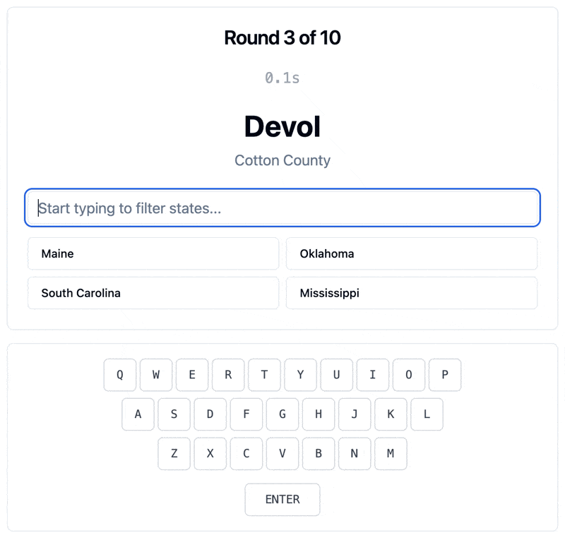
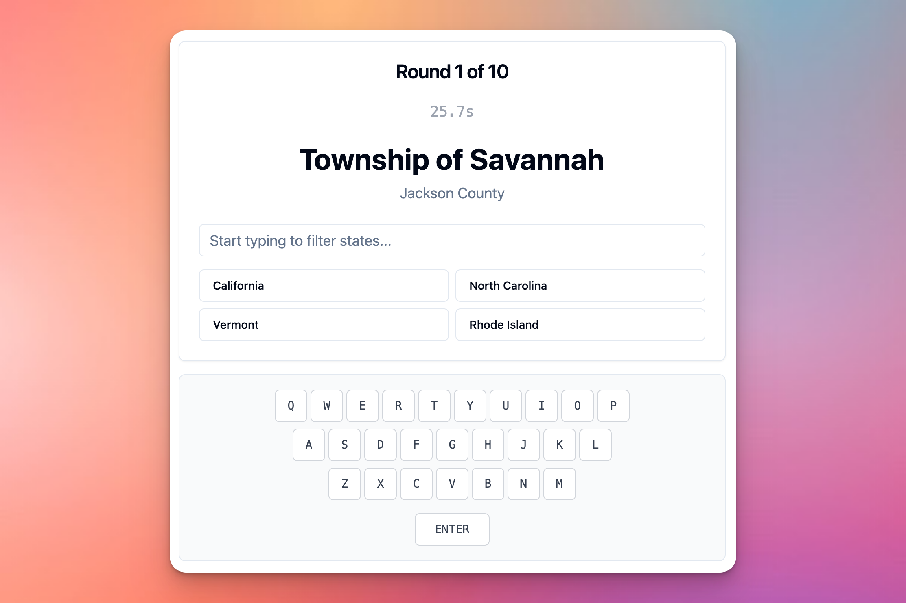

# 🌍⌨️ GeoKeys

**Where Geography Meets Typography!**

Transform your typing skills while exploring the United States, one city at a time. 



## 🎯 What is GeoKeys?

Ever wondered if you could improve your typing speed while becoming a geography whiz? Wonder no more! GeoKeys presents you with U.S. cities and challenges you to type the correct state as fast as possible. Watch the responsive QWERTY keyboard light up with every keystroke as you race against the clock!

## ✨ Features

🗺️ **Geography Challenge** - Test your knowledge of U.S. cities and their states  
⌨️ **Visual Keyboard** - Watch keys light up as you type with our gorgeous QWERTY display  
⏱️ **Speed Training** - Race against time to improve both accuracy and speed  
🎮 **Game Mechanics** - Score points, track progress, and climb the leaderboard  
📊 **Performance Stats** - See your typing speed, accuracy, and geography knowledge improve  
🏆 **Leaderboard** - Compete with others for the ultimate GeoKeys champion title  

## 🚀 How to Play

1. **See the City** - A U.S. city name appears with its county
2. **Start Typing** - Begin typing the state name and watch the keyboard light up
3. **Auto-Complete Magic** - The game helps you when you're on the right track
4. **Beat the Clock** - Answer as quickly as possible for maximum points
5. **Climb the Ranks** - Submit your score and see how you stack up!

## 🛠️ Tech Stack

**Frontend:**
- React with modern hooks
- Tailwind CSS
- Real-time keyboard visualization

**Backend:**
- Flask API for lightning-fast responses
- SQLite database with optimized queries
- RESTful endpoints for seamless gameplay

## 🏁 Getting Started



### Prerequisites
- Node.js (v14+)
- Python (v3.8+)
- A love for geography and typing!

### Installation

**Backend Setup:**
```bash
cd backend
pip install flask flask-cors flask-sqlalchemy pandas
python import_data.py  # Load the city database
python app.py          # Start the API server
```

**Frontend Setup:**
```bash
cd frontend
npm install
npm run dev            # Launch the game!
```

Visit `http://localhost:3000` and start your GeoKeys adventure!

## 📈 Why GeoKeys?

- **Learn While You Play** - Absorb U.S. geography knowledge naturally
- **Improve Typing Skills** - Build muscle memory and increase WPM
- **Visual Feedback** - See exactly which keys you're pressing
- **Gamification** - Points, timers, and leaderboards keep you engaged
- **Data-Driven** - Track your improvement over time

---

**Made with ❤️ for geography lovers and typing enthusiasts everywhere**