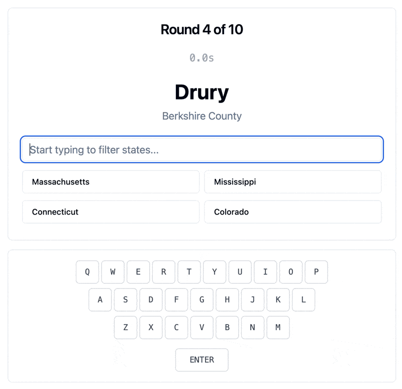

# 🌍 GeoKeys ⌨️

**Where Geography Meets a Typing Tutor!**

Transform your typing skills while exploring the United States, one city at a time. 

**🖥️ Desktop**: Full typing tutor experience with visual keyboard feedback  
**📱 Mobile**: Tap-to-select gameplay for on-the-go geography challenges 

## 🎮 Play Now!

  

  <strong>🌐 <a href="https://geokeys.vercel.app">https://geokeys.vercel.app</a></strong>

  

## 🎯 What is GeoKeys?

GeoKeys presents you with U.S. cities and challenges you to identify the correct state as fast as possible. 

**🖥️ On Desktop:** Type state names and watch the responsive QWERTY keyboard light up with every keystroke as you race against the clock. Perfect for improving your typing speed and accuracy!

**📱 On Mobile:** Tap to select the correct state from multiple choice options. Great for geography practice anywhere you go!

## ✨ Features

🗺️ **Geography Challenge** - Test your knowledge of U.S. cities and their states  
⌨️ **Typing Tutor** (Desktop) - Visual keyboard feedback and typing speed training  
📱 **Mobile-Friendly** - Touch-friendly interface for gaming on the go  
⏱️ **Speed Training** - Race against time to improve both accuracy and speed  
🎮 **Game Mechanics** - Score points, track progress, and climb the leaderboard  
📊 **Performance Stats** - See your geography knowledge and speed improve over time  
🏆 **Personal Leaderboard** - Track your best scores and improvement  

## 🚀 How to Play

### 🖥️ Desktop Experience
1. **See the City** - A U.S. city name appears with its county
2. **Start Typing** - Begin typing the state name and watch the keyboard light up
3. **Auto-Complete Magic** - The game helps you when you're on the right track
4. **Beat the Clock** - Answer as quickly as possible for maximum points
5. **Submit Score** - Track your improvement on your personal leaderboard

### 📱 Mobile Experience
1. **See the City** - A U.S. city name appears with its county
2. **Tap to Answer** - Choose the correct state from four options
3. **Beat the Clock** - Tap quickly for maximum points
4. **Submit Score** - Track your geography knowledge progress

## 🛠️ Tech Stack

**Frontend:**
- React with modern hooks
- Tailwind CSS
- Real-time keyboard visualization

**Backend:**
- Vercel Serverless Functions (Python)
- Static JSON data (173k+ US cities)
- Edge-deployed API endpoints
- Browser localStorage for personal leaderboards

## 🏁 Local Development

  

### Prerequisites
- Node.js (v16+)
- Git

### Local Setup

The vercelification of the app made the previous version, which supported self-hosting, irrelevant. But if you can hang with vercel-cli, you can still get it to run locally. 

Or, in other words: the live game runs on Vercel with serverless functions. For full local testing with API functions, use `npx vercel dev`. 

## 📈 Why GeoKeys?

- **Learn While You Play** - Absorb U.S. geography knowledge naturally
- **Improve Typing Skills** - Build muscle memory and increase WPM
- **Visual Feedback** - See exactly which keys you're pressing
- **Gamification** - Points, timers, and leaderboards keep you engaged
- **Data-Driven** - Track your improvement over time

## 🚀 Deployment

This app is deployed on [Vercel](https://vercel.com) using:
- Serverless Functions for the API
- Static hosting for the React frontend  
- Edge CDN for global performance
- Zero-config deployment from GitHub

---

**Made with ❤️ for geography hounds and typing enthusiasts everywhere**

**🎮 [Play GeoKeys Now](https://geokeys.vercel.app) | 🐙 [View Source](https://github.com/whileseated/geokeys)**